# UI/UX Redesign: Device-Child-User Management Flow

## Goal Description

The current UI has disconnected workflows that make it confusing for parents to:
1. Understand which device users have been detected
2. Assign detected users to their children's profiles
3. Configure monitoring settings per device-user
4. Know which users are being monitored vs ignored

This redesign creates a cohesive, intuitive flow that guides parents through:
- **Device Registration**: Automatic attachment to tenant
- **User Detection**: Devices report detected users
- **User Review**: Parents review and decide to monitor or ignore
- **Profile Assignment**: Link monitored users to child profiles
- **Settings Configuration**: Configure monitoring per device-user-child combination

### Navigation Flow Diagram

```mermaid
graph TD
    A[Parent Dashboard] --> B[Device-Centric Path]
    A --> C[Child-Centric Path]
    
    B --> D[Devices List]
    D --> E[Device Details]
    E --> F[Users on Device]
    F --> G[Device User × Child]
    
    C --> H[Children List]
    H --> I[Child Details]
    I --> J[Linked Device Users]
    J --> G[Device User × Child]
    
    G --> K[Configuration Page]
    K --> L[MonitoredUserSettings<br/>DeviceId + Username + ProfileId]
    
    style G fill:#4CAF50,stroke:#333,stroke-width:2px,color:#fff
    style L fill:#2196F3,stroke:#333,stroke-width:2px,color:#fff
```



**Key Insight**: Both paths converge at the same configuration entity, allowing flexible navigation based on parent's mental model.

## User Review Required

> [!IMPORTANT]
> **Hybrid Navigation Model**
> 
> The UI will support **both device-centric AND child-centric** navigation:
> 
> **Device-Centric Path**: Device → Users on Device → Assign to Child → Configure
> **Child-Centric Path**: Child Profile → Linked Device Users → Configure
> 
> Both paths lead to the same per-device-user-child configuration. A device can have **multiple configs** (one for each child with linked users on that device).
>
> **Key Insight**: Configuration is at the intersection of **Device × User × Child**, not just Device × User.

> [!IMPORTANT]
> **Unassigned User Management**
> 
> Parents must be able to:
> 1. **See** all detected users clearly, whether assigned to a child or not
> 2. **Edit/Configure** unassigned users (basic monitoring without child link)
> 3. **Remove** users completely from monitoring (stop watching)
> 4. **Assign later** - users can be monitored without being assigned to a child
>
> This allows parents to monitor an account first, then assign it to a child once they've confirmed it's actually their child's account.

> [!WARNING]
> **Data Model Change**
> 
> This requires updating `MonitoredUserSettings` to be keyed by (DeviceId, Username, ProfileId) instead of just (DeviceId, Username). This allows different monitoring settings for the same device-user when linked to different children.

## UX Writing & Terminology Guidelines

### Core Principles

1. **Use Parent Language, Not Technical Terms**
   - "Device user" → "Account" or "User"
   - "Monitored user" → "Account I'm watching"
   - "Profile" → "Child profile" or just "Child"
   - "Detected user" → "New account found"
   - "Ignored user" → "Not watching"

2. **Progressive Disclosure**
   - Start simple: Show only essential information
   - Reveal complexity: Advanced options in collapsible sections or separate pages
   - Clear hierarchy: Most common tasks should be 1-2 clicks

3. **Action-Oriented Language**
   - ❌ "Link profile to monitored user"
   - ✅ "Connect this account to [Child Name]"
   - ❌ "Configure monitoring settings"
   - ✅ "Set rules for [Child Name]"

### Terminology Reference

> [!IMPORTANT]
> **Critical Distinction**: A **Child Profile** is a person (Alice). A **Device Login** is a username on a device (alice@laptop). One child can have many device logins.

| Technical Term | UI Term | What It Represents | Usage Example |
|----------------|---------|-------------------|---------------|
| ApplicationUser (parent) | You, Your account | The parent who owns the TGP dashboard | "Your devices", "Invite a co-parent" |
| MonitoredProfile | Child, [Child Name] | **A PERSON** - One of your children (organizational container) | "Alice", "Create a child profile" |
| Device | Device, [Device Name] | Physical computer/tablet/phone | "Living Room PC", "Alice's iPad" |
| MonitoredUser | Login, [username] on [Device] | **A USERNAME** - Login on a specific device | "alice@laptop on Living Room PC" |
| DetectedUser | New login found | Username detected but not yet reviewed | "We found: 'john_smith'" |
| MonitoredProfileLink | Connected to [Child] | Association between device login and child | "alice@laptop is connected to Alice" |
| ApplicationUser (invited) | Family member account, Co-parent | Another adult invited to help monitor | "Invite a co-parent" |

**Key Examples:**
- ✅ "Alice has 3 logins across 2 devices" (Profile → multiple device logins)
- ✅ "Connect alice@laptop to Alice" (Device login → Child profile)
- ✅ "Your account settings" (TGP dashboard account)
- ❌ "Alice account" (Confusing - is this the child or a login?)
- ❌ "User alice" (Unclear context)

### Example Phrasings

**Detected User Flow (Conversational):**
```
Step 1: "Is 'JohnDoe' one of your children?"
  [Yes] [No, skip this account]

Step 2 (if Yes): "Would you like to:"
  [Connect to existing child ▼] (dropdown with child names)
  [Create new child profile]
```

**Good:**
- "Which child uses this login?" (device login → child profile)
- "Set rules for Alice on Living Room PC" (child → device context)
- "We found login 'BobSmith' on iPad"
- "alice@laptop on Living Room PC" (always show device with login)
- "Alice uses 3 devices" (child-centric view)
- "Alice has 2 logins on this device" (multiple device logins for one child)

**Avoid:**
- "Alice's account" (which one? Alice is a person, not a  login)
- "Connect user to profile" (both terms unclear)
- "Link monitored user to profile"
- "Configure per-device-user monitoring policy"
- "Device-user-profile configuration junction"

### Button & Action Labels

| Action | Good Label | Why |
|--------|-----------|-----|
| Assign login to child | "Connect to [Child]" | Clear what you're doing |
| Configure settings | "Manage rules" | Parents think in terms of rules |
| Ignore login | "Skip this login" | Clear action |
| Unlink | "Disconnect from [Child]" | Clear separation |
| View details | "View" or device/child name | Less verbose |

### Empty States & Onboarding

**New Parent Experience:**
1. No devices: "Install TGP on your family's devices to get started"
2. Device but no users: "Waiting for someone to log in..."
3. Detected users: "New accounts found! Let us know which are your children."
4. No children: "Add your children's profiles to organize monitoring"

## Proposed Changes

### Data Model Changes

#### [MODIFY] [MonitoredUserSettings.cs](file:///c:/Users/bapen/source/repos/ByronAP/TGP.UserDashboard/src/TGP.Data/src/TGP.Data/Entities/MonitoredUserSettings.cs)

**Critical Change**: Add `ProfileId` to support per-child configurations for the same device-user.

Current model: Settings are per `MonitoredUser` (Device × Username)
New model: Settings are per `MonitoredUser` × `Profile` (Device × Username × Child)

```csharp
public class MonitoredUserSettings
{
    public Guid Id { get; set; }
    public Guid MonitoredUserId { get; set; }
    public Guid? ProfileId { get; set; }  // NEW: Link to child profile
    
    // ... existing settings fields ...
    
    // Navigation
    public virtual MonitoredUser MonitoredUser { get; set; } = null!;
    public virtual MonitoredProfile? Profile { get; set; }  // NEW
}
```

This allows:
- Same device-user to have different settings when linked to different children
- Unlinked users to have default settings (ProfileId = null)
- Easy querying of "all settings for Child A" across all devices

#### [MODIFY] Database Migration

Create migration to:
- Add `ProfileId` column to `MonitoredUserSettings`
- Add foreign key constraint
- Update unique index from `(MonitoredUserId)` to `(MonitoredUserId, ProfileId)`
- Migrate existing data (set ProfileId based on current MonitoredProfileLink)

---

### Dashboard & Navigation

#### [MODIFY] [\_Layout.cshtml](file:///c:/Users/bapen/source/repos/ByronAP/TGP.UserDashboard/src/TGP.UserDashboard/Pages/Shared/_Layout.cshtml)

- Add badge indicator to Devices nav showing count of unreviewed detected users
- Consider adding "Pending Users" as a quick-access nav item

#### [MODIFY] [Index.cshtml](file:///c:/Users/bapen/source/repos/ByronAP/TGP.UserDashboard/src/TGP.UserDashboard/Pages/Dashboard/Index.cshtml) & [IndexModel](file:///c:/Users/bapen/source/repos/ByronAP/TGP.UserDashboard/src/TGP.UserDashboard/Pages/Dashboard/Index.cshtml.cs)

- Add prominent alert card for pending detected users
- Show quick stats: total devices, monitored users, pending review
- Add quick links to review pending users

---

### Device Management

#### [MODIFY] [Devices/Index.cshtml](file:///c:/Users/bapen/source/repos/ByronAP/TGP.UserDashboard/src/TGP.UserDashboard/Pages/Devices/Index.cshtml) & [IndexModel](file:///c:/Users/bapen/source/repos/ByronAP/TGP.UserDashboard/src/TGP.UserDashboard/Pages/Devices/Index.cshtml.cs)

**Show clear user counts on each device card:**

- **Connected accounts**: Shows count of users assigned to children (e.g., "3 children's accounts")
- **Other accounts**: Shows count of monitored but unassigned users (e.g., "2 other accounts")
- **New**: Badge for pending detected users (e.g., "1 new")

Example device card:
```
┌─────────────────────────────┐
│ 🖥️ Living Room PC          │
│    3 children's accounts    │
│    2 other accounts         │
│    [NEW] 1 new account      │
└─────────────────────────────┘
```

#### [MODIFY] [Devices/Details.cshtml](file:///c:/Users/bapen/source/repos/ByronAP/TGP.UserDashboard/src/TGP.UserDashboard/Pages/Devices/Details.cshtml) & [DetailsModel](file:///c:/Users/bapen/source/repos/ByronAP/TGP.UserDashboard/src/TGP.UserDashboard/Pages/Devices/Details.cshtml.cs)

**Major Redesign** - Replace "Users on This Device" section with categorized lists:

1. **New Accounts Found** (Pending Review Section)
   - Header: "New accounts found on this device"
   - For each user: Show avatar, username, "First seen: [date]"
   
   **Conversational Flow UI:**
   ```
   ┌─────────────────────────────────────────┐
   │ 👤 JohnDoe                              │
   │ First seen: Dec 31, 2025                │
   │                                         │
   │ Is 'JohnDoe' one of your children?      │
   │                                         │
   │ [Yes, set up monitoring]  [No, skip]    │
   └─────────────────────────────────────────┘
   ```
   
   **On "Yes" click** → Show inline modal/expansion:
   ```
   Would you like to:
   
   ( ) Connect to existing child:
       [Select child ▼] (Alice, Bob, Charlie)
   
   ( ) Create new child profile:
       [Child's name: ________] [Color: 🎨]
   
   [Continue] [Cancel]
   ```
   
   - After selection: Immediately start monitoring and assign to child
   - Show success: "Now watching JohnDoe for [Child Name]"

2. **Accounts I'm Watching**
   - Two subsections with clear headers:
   
   **A. Assigned to Children** (grouped by child, always visible)
   - Header per child: "Alice's Accounts"
   - Show child avatar + device account username + device name
   - Display format: "alice@laptop (Living Room PC)"
   - Actions per account:
     - "Manage rules" (primary button)
     - "Disconnect from Alice" (secondary link)
   
   **B. Other Accounts** (unassigned, PROMINENTLY DISPLAYED)
   - Header: "Other accounts on this device"
   - Microcopy: "These accounts are being monitored but not connected to a child"
   - **Always expanded** (not collapsed) to ensure visibility
   - Show each account with:
     - Username with device icon (e.g., "💻 john_work")
     - "Started monitoring: [date]"
     - Last activity indicator
   - Actions per account:
     - **"Connect to..."** (dropdown with child names) - Primary
     - **"Edit basic rules"** (link to settings without child requirement)
     - **"Stop watching"** (remove from monitoring entirely)
   - Empty state: "All accounts on this device are connected to children"

3. **Skipped Accounts** (collapsible, collapsed by default)
   - Header: "Accounts I'm not watching"
   - Show count in header: "Skipped (2)"
   - Quick action: "Start watching" link
   - Microcopy: "These won't send any monitoring data"

#### [MODIFY] [Devices/DetectedUsers.cshtml](file:///c:/Users/bapen/source/repos/ByronAP/TGP.UserDashboard/src/TGP.UserDashboard/Pages/Devices/DetectedUsers.cshtml) & [DetectedUsersModel](file:///c:/Users/bapen/source/repos/ByronAP/TGP.UserDashboard/src/TGP.UserDashboard/Pages/Devices/DetectedUsers.cshtml.cs)

**Rename page**: "New Accounts to Review"

- Page title: "New accounts found"
- Subtitle: "Tell us which accounts belong to your children"
- For each account: Device name, username, date found
- **Conversational interaction** (same as Device Details):
  - Question: "Is '[username]' one of your children?"
  - Two-step flow: Yes → Choose existing or create new
  - Quick skip option for non-children accounts
- Bulk actions: 
  - "Skip all selected"
  - Checkbox selection
- Filter: "Show all" / "By device" dropdown
- Empty state: "All caught up! No new accounts to review."

**Inline Child Creation Modal:**
- Quick form: Name + Color picker
- Validates name (not empty, reasonable length)
- On submit: Creates profile and links user in one transaction
- Shows in dropdown immediately for other detected users

#### [MODIFY] [Devices/UserSettings.cshtml](file:///c:/Users/bapen/source/repos/ByronAP/TGP.UserDashboard/src/TGP.UserDashboard/Pages/Devices/UserSettings.cshtml) & [UserSettingsModel](file:///c:/Users/bapen/source/repos/ByronAP/TGP.UserDashboard/src/TGP.UserDashboard/Pages/Devices/UserSettings.cshtml.cs)

**Updated to support ProfileId parameter**:

- URL pattern: `/Devices/UserSettings?deviceId={deviceId}&username={username}&profileId={profileId?}`
- **ProfileId is optional** - allows editing unassigned users

**For UNASSIGNED users** (no profileId):
- **Breadcrumb**: [Device Name] › [Username] › Basic Rules
- **Page title**: "Basic rules for [Username] on [Device Name]"
- **Info banner**: 
  ```
  ℹ️ This account isn't connected to a child yet.
  You can set basic monitoring rules now and connect it to a child later.
  [Connect to a child...] button
  ```
- **Available settings** (limited scope):
  - Basic monitoring toggles (web history, app usage)
  - No restrictions (can't block websites/apps without child assignment)
  - Explanation: "Connect to a child to set web filters and screen time limits"
- **Actions**:
  - "Connect to..." (assign to child, redirects to full settings)
  - "Stop watching this account" (remove from monitoring)

**For ASSIGNED users** (has profileId):
- **Breadcrumb**: [Device Name] › [Username] › Rules for [Child Name]
- **Page title**: "Rules for [Child Name] on [Device Name]"
- If user linked to multiple children:
  - Dropdown to switch: "Viewing rules for: [Child Name] ▼"
- Full settings available:
  - "Screen Time" (not "Screen Time Restrictions")
  - "Websites" (not "Web Restrictions")
  - "Apps" (not "Application Restrictions")
- Advanced toggle: "Show advanced options" (for keylogging etc.)
- Helper actions:
  - "Copy [Other Child]'s rules" button
  - "Disconnect from [Child Name]" (unassign, keeps monitoring)

---

---

### Unassigned User Management

#### [NEW] [Devices/UnassignedUsers.cshtml](file:///c:/Users/bapen/source/repos/ByronAP/TGP.UserDashboard/src/TGP.UserDashboard/Pages/Devices/UnassignedUsers.cshtml) & [UnassignedUsersModel](file:///c:/Users/bapen/source/repos/ByronAP/TGP.UserDashboard/src/TGP.UserDashboard/Pages/Devices/UnassignedUsers.cshtml.cs)

**New dedicated page for managing accounts not assigned to children**

- **Page title**: "Accounts I'm watching"
- **Subtitle**: "These accounts are monitored but not connected to a child yet"
- **Navigation**: Add to main nav or as prominent link on dashboard
- Show all monitored users across all devices that don't have a child assignment
- **Table/List view** with columns:
  - Device name (with icon)
  - Username
  - Started monitoring (date)
  - Last activity
  - Actions
- **Actions per user**:
  - "Connect to..." → Opens same two-step flow (existing or create new)
  - "Edit basic rules" (link to UserSettings without profileId)
  - "Stop watching" (remove from monitoring)
- **Bulk actions**:
  - Select multiple
  - "Connect selected to..." (bulk assign to one child)
  - "Stop watching selected"
- **Empty state**: "All monitored accounts are connected to children! 🎉"

---

### Child Profile Management (Child-Centric Path)

#### [MODIFY] [Children/Index.cshtml](file:///c:/Users/bapen/source/repos/ByronAP/TGP.UserDashboard/src/TGP.UserDashboard/Pages/Children/Index.cshtml) & [IndexModel](file:///c:/Users/bapen/source/repos/ByronAP/TGP.UserDashboard/src/TGP.UserDashboard/Pages/Children/Index.cshtml.cs)

- Show linked account count on each child card
- Show monitoring status summary (e.g., "3 devices monitored")
- Add indicator for children with no linked accounts
- Add quick stats: pending users that could be assigned

#### [MODIFY] [Children/Details.cshtml](file:///c:/Users/bapen/source/repos/ByronAP/TGP.UserDashboard/src/TGP.UserDashboard/Pages/Children/Details.cshtml) & [DetailsModel](file:///c:/Users/bapen/source/repos/ByronAP/TGP.UserDashboard/src/TGP.UserDashboard/Pages/Children/Details.cshtml.cs)

**Enhanced to be equal-power navigation path**:

1. **Linked Device Users Section**
   - Group by device, show all linked users per device
   - For each device-user: Show settings summary (monitoring enabled, time limits, etc.)
   - **Quick action**: "Manage rules" → Navigate to UserSettings page with profileId
   - Allow unlinking: "Disconnect" (keeps monitoring, just removes child association)

2. **Available to Connect Section**
   - Header: "Accounts you can connect to [Child Name]"
   - Two tabs/subsections:
     
     **Tab: Other Accounts (Unassigned)**
     - Show all monitored users not assigned to any child
     - Display: Device name, username, "Watching since [date]"
     - Action: "Connect to [Child Name]" button
     
     **Tab: New Accounts**
     - Show pending detected users
     - Display: Device name, username, "Found on [date]"
     - Action: "Connect & start watching" (assigns + monitors in one action)

3. **Bulk Configuration** (Future enhancement)
   - "Apply same rules to all linked accounts"
   - Useful for applying consistent rules across all devices for one child

---

### Backend Services

#### [MODIFY] [DeviceManagementService.cs](file:///c:/Users/bapen/source/repos/ByronAP/TGP.UserDashboard/src/TGP.UserDashboard/Services/DeviceManagementService.cs)

Add new methods:
- `GetDeviceUserStatesAsync(deviceId, tenantId)` - Returns categorized users
- `GetPendingDetectedUsersCountAsync(tenantId)` - For dashboard/nav badges
- `GetUnassignedMonitoredUsersAsync(tenantId)` - For child assignment
- `ReviewAndMonitorDetectedUserAsync(detectedUserId, childProfileId?, tenantId)` - Combined action
- **`CreateChildAndAssignUserAsync(userId, tenantId, childName, color, detectedUserId)`** - NEW: Creates profile and assigns in one transaction

#### [MODIFY] [ChildrenService.cs](file:///c:/Users/bapen/source/repos/ByronAP/TGP.UserDashboard/src/TGP.UserDashboard/Services/ChildrenService.cs)

Add new methods:
- `GetAvailableUsersForLinkingAsync(profileId, tenantId)` - Shows unassigned monitored users
- `LinkAndMonitorAsync(profileId, detectedUserId, tenantId)` - Assign detected user to child in one action

#### [NEW] [Models/DeviceUserStateDto.cs](file:///c:/Users/bapen/source/repos/ByronAP/TGP.UserDashboard/src/TGP.UserDashboard/Models/DeviceUserStateDto.cs)

Create unified DTO:
```csharp
public class DeviceUserStateDto
{
    public Guid DeviceId { get; set; }
    public string Username { get; set; }
    public UserState State { get; set; } // Pending, Monitored, Ignored
    public Guid? LinkedProfileId { get; set; }
    public string? LinkedProfileName { get; set; }
    public DateTime DetectedAt { get; set; }
}

public enum UserState { Pending, Monitored, Ignored }
```

---

### UI Components & Styling

#### [NEW] [wwwroot/css/components/user-state-badge.css](file:///c:/Users/bapen/source/repos/ByronAP/TGP.UserDashboard/src/TGP.UserDashboard/wwwroot/css/components/user-state-badge.css)

Create reusable badge component for user states:
- Pending (yellow/warning)
- Linked (green/success)
- Unassigned (blue/info)
- Ignored (gray/muted)

#### [NEW] [Pages/Shared/_UserStatePartial.cshtml](file:///c:/Users/bapen/source/repos/ByronAP/TGP.UserDashboard/src/TGP.UserDashboard/Pages/Shared/_UserStatePartial.cshtml)

Reusable partial for displaying user with state badge and quick actions

#### [NEW] [Pages/Shared/_DetectedUserReviewPartial.cshtml](file:///c:/Users/bapen/source/repos/ByronAP/TGP.UserDashboard/src/TGP.UserDashboard/Pages/Shared/_DetectedUserReviewPartial.cshtml)

Reusable component for the two-step conversational flow:
- Step 1: "Is '[username]' one of your children?" with Yes/No buttons
- Step 2 (on Yes): Radio buttons for existing child or create new
- Inline form for creating new child (name + color)
- Handles form submission and validation
- Shows success/error feedback

#### [NEW] [Pages/Shared/_QuickAssignDropdownPartial.cshtml](file:///c:/Users/bapen/source/repos/ByronAP/TGP.UserDashboard/src/TGP.UserDashboard/Pages/Shared/_QuickAssignDropdownPartial.cshtml)

Dropdown component for assigning user to child profile with inline form

## Cleanup & Refactoring

### Code to Remove/Refactor

#### [DELETE] Old/unused DTOs and models
- Review for any legacy models that are no longer used
- Remove dead code paths

#### [REFACTOR] Terminology Updates
- **ChildAccountLinkDto** → **ChildLoginLinkDto** (in `ChildrenService.cs`)
  - Update all references to use "Login" terminology
  - Rename DTO properties if needed for clarity

#### [REVIEW] Existing pages for unused code
Before adding new pages, review existing ones for:
- Commented-out code
- Unused view models or properties
- Old logic that will be replaced by new services

### Database Cleanup (if needed)
- Check for any orphaned records after migration
- Verify foreign key constraints are working
- Clean up any test data

---

## Verification Plan

### Automated CI/CD Workflow

After each significant change:

1. **Commit & Push**
   - Commit changes with clear message
   - Push to repository
   - CI/CD automatically triggers

2. **Monitor Build Pipeline**
   - Watch GitHub Actions or CI/CD logs
   - Verify build succeeds
   - Check for any compilation errors or warnings

3. **Monitor Deployment**
   - Verify deployment to Azure Container Apps succeeds
   - Check deployment logs for issues
   - Wait for healthy container status

4. **Live Site Testing**
   - Navigate to https://tgp-dashboard-prod.lemonsand-0fd9cbe0.northcentralus.azurecontainerapps.io/
   - Test the deployed changes
   - Verify UI renders correctly
   - Test user flows end-to-end

5. **Infrastructure Review** (if needed)
   - Check container logs in Azure
   - Verify database migrations applied
   - Check application insights for errors

### Testing Scenarios

#### Flow 1: New Device Setup & User Detection
1. Log in to live dashboard
2. Simulate device registration (or use existing device)
3. Check Dashboard for "New logins found" alert
4. Navigate to Devices → Device Details
5. Verify "New logins found" section appears
6. Test conversational flow: "Is 'username' one of your children?"
7. Try both: Connect to existing child + Create new child

#### Flow 2: Unassigned Login Management
1. Navigate to new "Logins I'm watching" page
2. Verify all unassigned logins show clearly
3. Test "Connect to..." action
4. Test "Edit basic rules" (limited settings)
5. Test "Stop watching" action

#### Flow 3: Child-Centric Navigation
1. Navigate to Children → Child Details
2. Verify "Alice's Logins" section shows all device logins
3. Test "Manage rules" link (should go to UserSettings with profileId)
4. Verify breadcrumb shows: Device › Username › Rules for Alice

#### Flow 4: Per-Login-Child Configuration
1. Access UserSettings for unassigned login (no profileId)
2. Verify limited settings (basic monitoring only)
3. Verify "Connect to child" banner shows
4. Connect to child and verify full settings unlock
5. Test settings save correctly with profileId

### Data Integrity Checks

After migration and deployment:
- [ ] Verify existing MonitoredUserSettings have ProfileId populated
- [ ] Check no orphaned records
- [ ] Verify foreign key constraints working
- [ ] Test tenant data isolation still works

### Edge Cases

- [ ] Delete child profile with linked logins → Verify graceful handling
- [ ] Device with no logins → Verify empty state
- [ ] Login linked to multiple children (shouldn't be possible) → Verify constraint
- [ ] Concurrent updates to same login → Verify no data corruption
