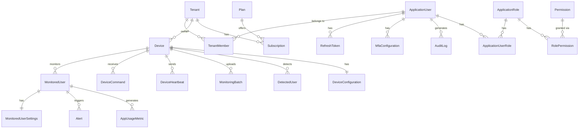

# Entity Relationship Diagram (ERD)

## Core Entities Overview

## Entity Groups

### Identity & Access
- **ApplicationUser**: User accounts
- **ApplicationRole**: Roles (Admin, Parent, etc.)
- **Permission**: Granular permissions
- **RefreshToken**: JWT refresh tokens
- **MfaConfiguration**: Multi-factor auth settings

### Tenancy
- **Tenant**: Organization/family unit
- **TenantMember**: User-Tenant membership
- **Subscription**: Billing subscription
- **Plan**: Subscription tiers

### Devices
- **Device**: Enrolled devices (Windows, Android, ChromeOS)
- **DeviceConfiguration**: Per-device settings
- **DeviceHeartbeat**: Health check records
- **DeviceCommand**: Remote commands

### Monitoring
- **MonitoredUser**: Users being monitored on devices
- **MonitoredUserSettings**: Monitoring rules per user
- **MonitoringBatch**: Uploaded telemetry batches
- **DetectedUser**: New users pending review
- **AppUsageMetric**: Application usage data
- **Alert**: Triggered alerts

### Security & Audit
- **AuditLog**: Security audit trail
- **LoginAttempt**: Login attempt tracking
- **ParentalConsent**: COPPA consent records
