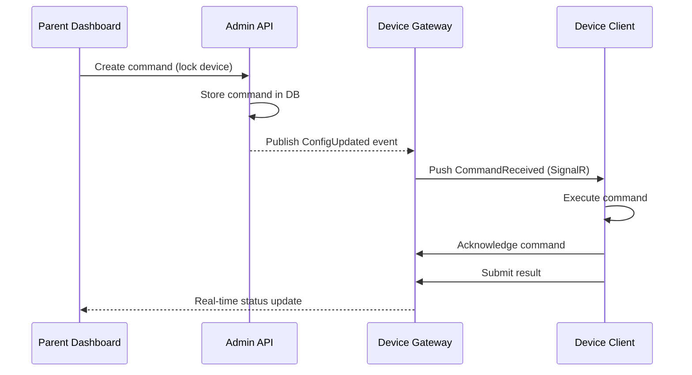
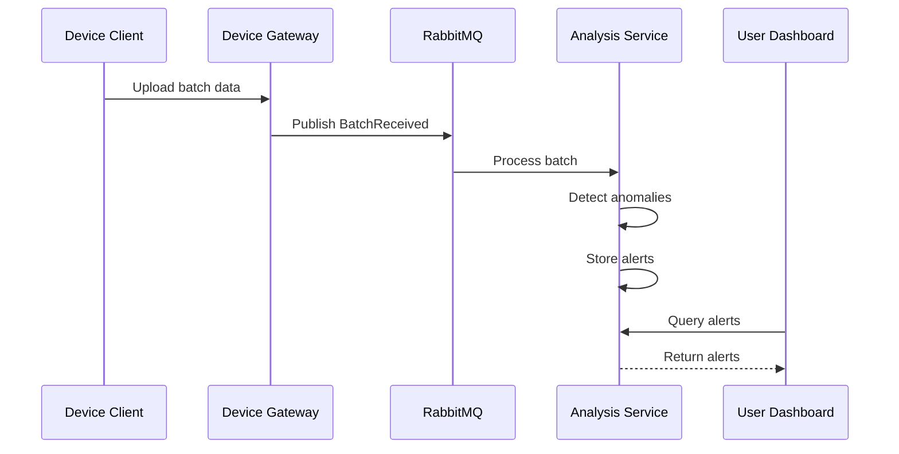
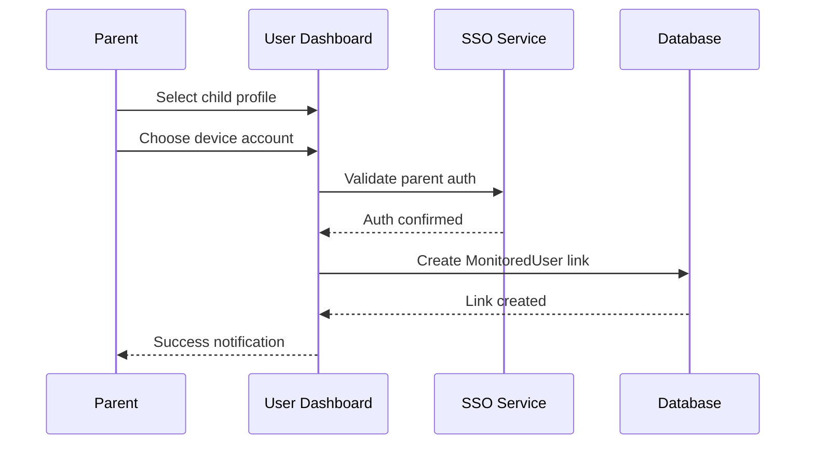
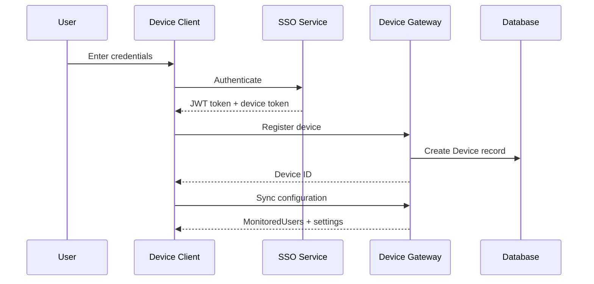

# Sequence Diagrams

## Device Command Flow

```mermaid
sequenceDiagram
    participant Parent as Parent Dashboard
    participant API as Admin API
    participant Gateway as Device Gateway
    participant Device as Device Client
    
    Parent->>API: Create command (lock device)
    API->>API: Store command in DB
    API-->>Gateway: Publish ConfigUpdated event
    Gateway->>Device: Push CommandReceived (SignalR)
    Device->>Device: Execute command
    Device->>Gateway: Acknowledge command
    Device->>Gateway: Submit result
    Gateway-->>Parent: Real-time status update
```

## Alerts Ingestion to Dashboard

```mermaid
sequenceDiagram
    participant Device as Device Client
    participant Gateway as Device Gateway
    participant Queue as RabbitMQ
    participant Analysis as Analysis Service
    participant Dashboard as User Dashboard
    
    Device->>Gateway: Upload batch data
    Gateway->>Queue: Publish BatchReceived
    Queue->>Analysis: Process batch
    Analysis->>Analysis: Detect anomalies
    Analysis->>Analysis: Store alerts
    Dashboard->>Analysis: Query alerts
    Analysis-->>Dashboard: Return alerts
```

## Children Link Account Flow

```mermaid
sequenceDiagram
    participant Parent as Parent
    participant Dashboard as User Dashboard
    participant SSO as SSO Service
    participant DB as Database
    
    Parent->>Dashboard: Select child profile
    Parent->>Dashboard: Choose device account
    Dashboard->>SSO: Validate parent auth
    SSO-->>Dashboard: Auth confirmed
    Dashboard->>DB: Create MonitoredUser link
    DB-->>Dashboard: Link created
    Dashboard-->>Parent: Success notification
```

## Device Registration Flow

```mermaid
sequenceDiagram
    participant User as User
    participant Client as Device Client
    participant SSO as SSO Service
    participant Gateway as Device Gateway
    participant DB as Database
    
    User->>Client: Enter credentials
    Client->>SSO: Authenticate
    SSO-->>Client: JWT token + device token
    Client->>Gateway: Register device
    Gateway->>DB: Create Device record
    Gateway-->>Client: Device ID
    Client->>Gateway: Sync configuration
    Gateway-->>Client: MonitoredUsers + settings
```
